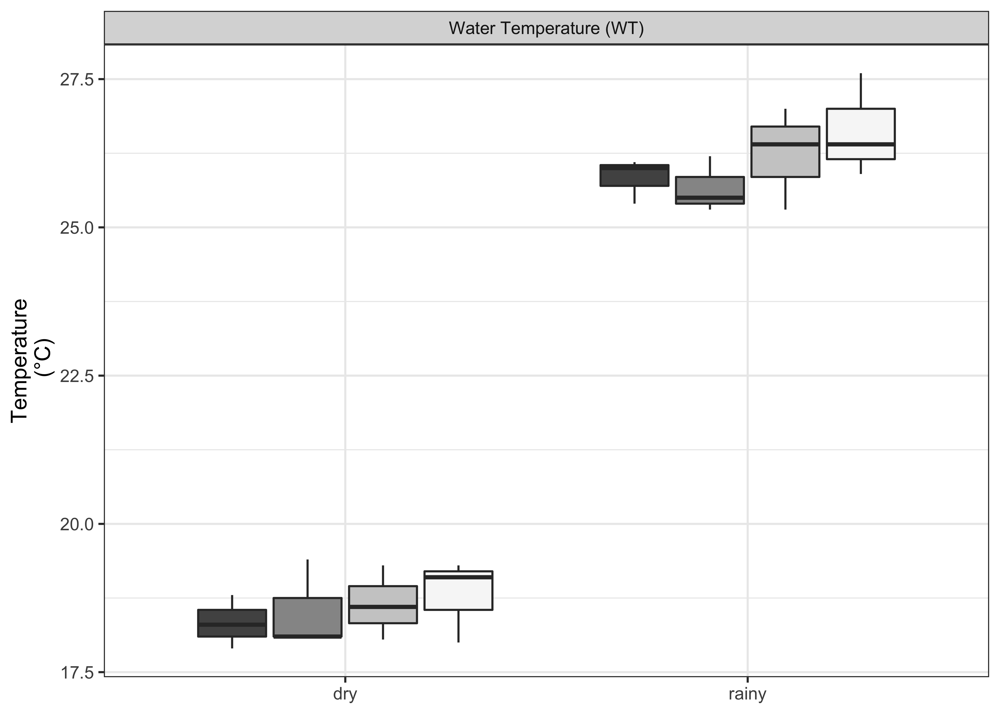
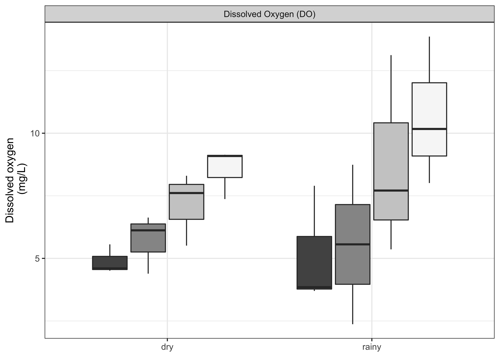
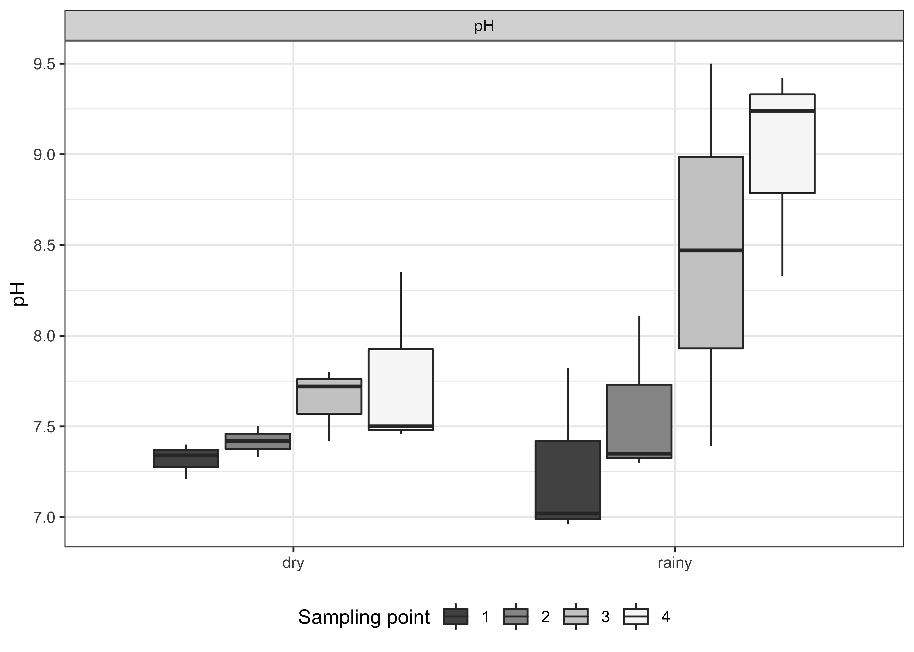
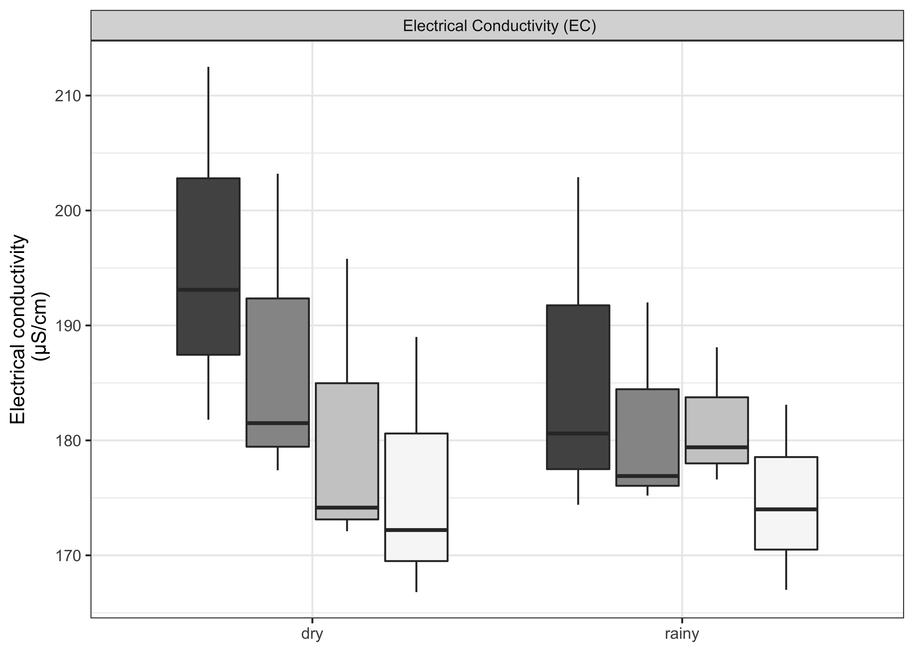
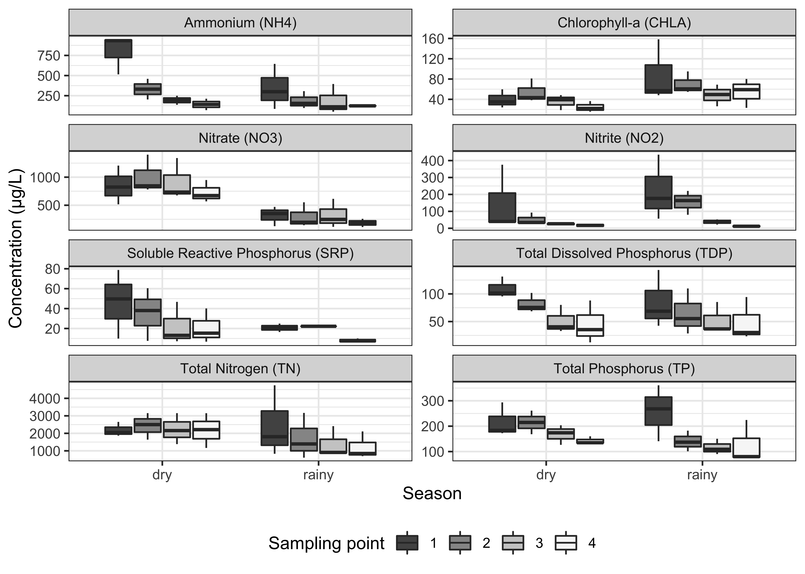
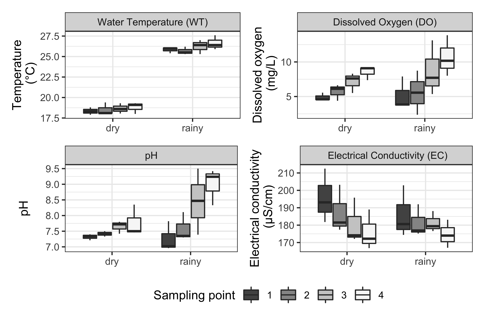
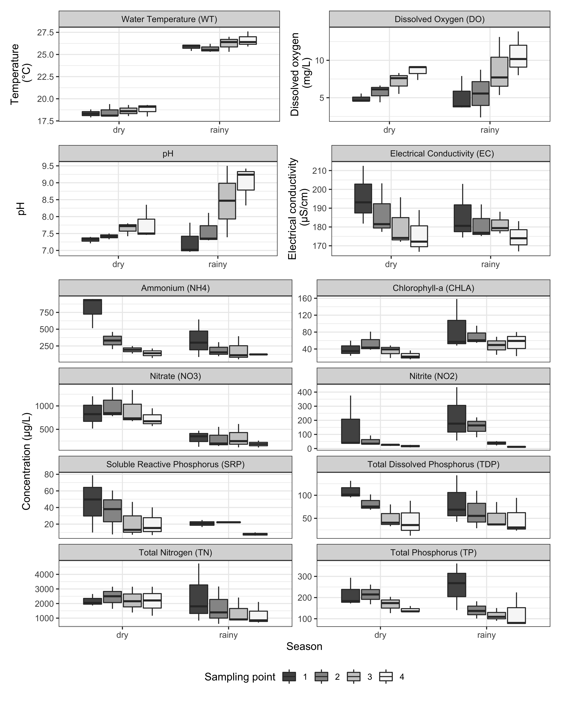

Graphs
================
Beatriz Milz
3 de novembro de 2018

# Load packages

``` r
library(ggplot2)
devtools::load_all()
```

    ## ℹ Loading manuscript.AmbiAgua

## Prepare dataset

``` r
sampling_data  <- sampling_data_long %>%
  dplyr::mutate(sampling_point = forcats::as_factor(sampling_sites)) %>%
  dplyr::left_join(variable_names) %>%
  dplyr::mutate(
    variable_name_abrev  = dplyr::case_when(
      variable == "water_temperature" ~ "Water Temperature (WT)",
      variable == "dissolved_oxygen" ~ "Dissolved Oxygen (DO)",
      variable == "ph" ~ "pH",
      variable == "electrical_conductivity" ~ " Electrical Conductivity (EC)",
      
      TRUE ~ paste0(variable_name, " (", variable, ")")
    )
  )
```

    ## Joining, by = "variable"

``` r
dplyr::glimpse(sampling_data)
```

    ## Rows: 456
    ## Columns: 11
    ## $ id                  <dbl> 11, 11, 11, 11, 11, 11, 11, 11, 11, 11, 11, 11, 11…
    ## $ sampling_event      <chr> "Aug/2016", "Aug/2016", "Aug/2016", "Aug/2016", "A…
    ## $ sampling_event_num  <dbl> 1, 1, 1, 1, 1, 1, 1, 1, 1, 1, 1, 1, 1, 1, 1, 1, 1,…
    ## $ sampling_sites      <dbl> 1, 1, 1, 1, 1, 1, 1, 1, 1, 1, 1, 1, 1, 1, 1, 1, 1,…
    ## $ season              <chr> "dry", "dry", "dry", "dry", "dry", "dry", "dry", "…
    ## $ tsi_tsr_class       <chr> "Hypereutrophic", "Hypereutrophic", "Hypereutrophi…
    ## $ variable            <chr> "TN", "NO2", "NO3", "NH4", "TP", "TDP", "SRP", "CH…
    ## $ result_variable     <dbl> 2653.42, 34.78, 517.16, 933.35, 172.36, 95.47, 9.8…
    ## $ sampling_point      <fct> 1, 1, 1, 1, 1, 1, 1, 1, 1, 1, 1, 1, 1, 1, 1, 1, 1,…
    ## $ variable_name       <chr> "Total Nitrogen", "Nitrite", "Nitrate", "Ammonium"…
    ## $ variable_name_abrev <chr> "Total Nitrogen (TN)", "Nitrite (NO2)", "Nitrate (…

## WT/DO/pH/EC

### Water temperature

``` r
boxplot_wt <- create_boxplot(variavel_y = "water_temperature",
                             legenda_y =  "Temperature\n (°C)")

boxplot_wt
```

<!-- -->

### Dissolved oxygen

``` r
boxplot_od <- create_boxplot(
               variavel_y = "dissolved_oxygen",
               legenda_y =  "Dissolved oxygen\n (mg/L)")

boxplot_od
```

<!-- -->

### pH

``` r
boxplot_ph <- create_boxplot(
  variavel_y = "ph",
  legenda_y =  "pH",
  esconder_legenda_x = TRUE,
  esconder_legenda_fill = FALSE
)

boxplot_ph
```

<!-- -->

### Electrical conductivity

``` r
boxplot_ce <- create_boxplot(
               variavel_y = "electrical_conductivity",
               legenda_y =  "Electrical conductivity\n (μS/cm)",
               esconder_legenda_x = TRUE)

boxplot_ce
```

<!-- -->

## Nutrients

``` r
boxplot_nutri <- sampling_data %>%
  dplyr::filter(variable %in% c("TN", "NO2", "NO3", "NH4", "TP", "TDP", "SRP", "CHLA")) %>%
  dplyr::mutate(
    variable = forcats::fct_relevel(variable ,
                                    "TN", "NO2", "NO3", "NH4", "TP", "TDP", "SRP", "CHLA")
  ) %>%
  ggplot() +
  geom_boxplot(aes(x = season, y = result_variable, fill = sampling_point)) +
  scale_fill_brewer(palette = "Greys", direction = -1) +
  labs(x = "Season",
       y = "Concentration (μg/L)",
       fill = "Sampling point") +
  theme_bw() +
  facet_wrap( ~ variable_name_abrev, scales = "free_y", ncol = 2) +
  theme(legend.position = "bottom",
        plot.title = element_text(hjust = 0.5))

boxplot_nutri
```

    ## Warning: Removed 14 rows containing non-finite values (stat_boxplot).

<!-- -->

``` r
ggsave(
  boxplot_nutri,
  filename = "../images/boxplot_lab.png",
  width = 6,
  height = 5,
  dpi = 600
)
```

    ## Warning: Removed 14 rows containing non-finite values (stat_boxplot).

## Unir os gráficos

``` r
library(patchwork)

boxplot_sonda <- (boxplot_wt + boxplot_od) /
  (boxplot_ph + boxplot_ce) +
  
  plot_layout(guides = "collect") &
  theme(legend.position = 'bottom')

boxplot_sonda
```

<!-- -->

``` r
boxplot_sonda %>% ggsave(
  filename = "../images/boxplot_sonda.png",
  width = 6,
  height = 4,
  dpi = 600
)
```

``` r
layout <- c(area(
  t = 1,
  l = 1,
  b = 2,
  r = 4
),
area(
  t = 3,
  l = 1,
  b = 4,
  r = 4
),
area(
  t = 5,
  l = 1,
  b = 11,
  r = 4
))


boxplot_geral <- (boxplot_wt + boxplot_od) /
  (boxplot_ph + boxplot_ce) /
  boxplot_nutri +
  plot_layout(guides = "collect", design = layout) &
  theme(legend.position = 'bottom')

boxplot_geral
```

    ## Warning: Removed 14 rows containing non-finite values (stat_boxplot).

<!-- -->

``` r
boxplot_geral %>% ggsave(
  filename = "../images/boxplot_geral.png",
  width = 8,
  height = 10,
  dpi = 600
)
```

    ## Warning: Removed 14 rows containing non-finite values (stat_boxplot).
