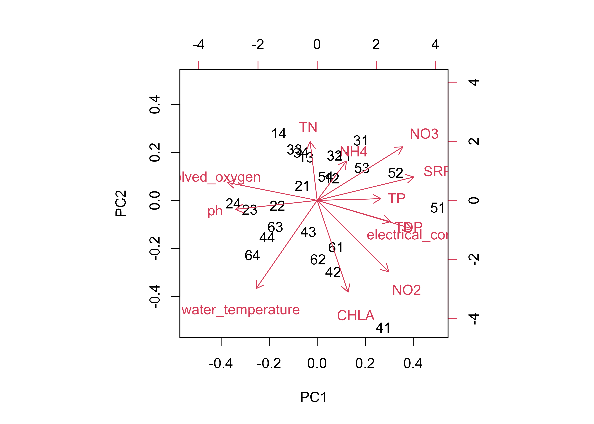
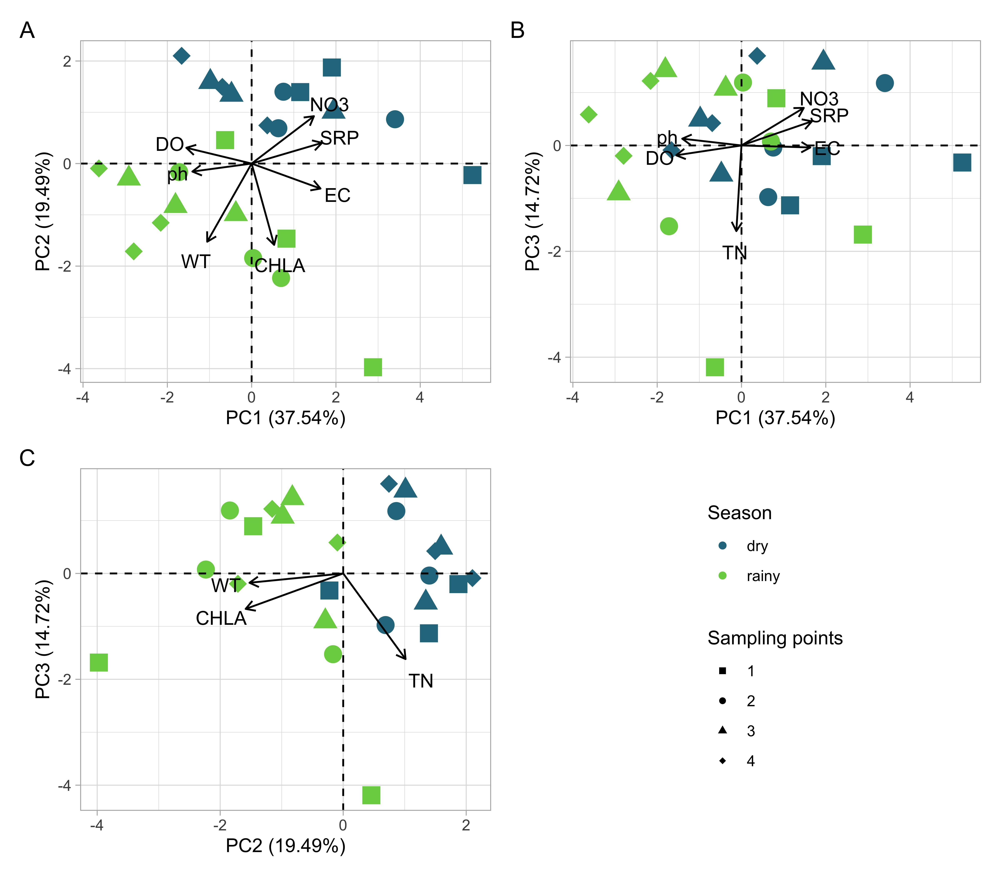

PCA
================

Referências sobre PCA:

-   [PCA no
    R](http://www.sthda.com/english/articles/31-principal-component-methods-in-r-practical-guide/118-principal-component-analysis-in-r-prcomp-vs-princomp/#theory-behind-pca-results);

-   [função PRCOMP](http://wiki.icmc.usp.br/images/a/ab/Prcomp.pdf);

-   [documentação da função
    prcomp](https://www.rdocumentation.org/packages/stats/versions/3.6.2/topics/prcomp)

## Sobre a PCA:

-   Os valores abaixo do limite de quantificação e de detecção foram
    substituídos por 0. Não pode ter dados faltantes (NA) na base.

-   Feita usando a função `prcomp()` do R base, com o argumento
    `scale = TRUE` - as variáveis ( *scale: a logical value indicating
    whether the variables should be scaled to have unit variance before
    the analysis takes place* )

-   As visualizações de PCA foram feitas com o pacote ggplot2. As
    visualizações da PCA estão ao final da página.

-   **Variáveis:** Sobre a escolha das variáveis:

-   **Dados sobre a coleta**:

    -   ID - Número de dois dígitos, composto por 1) número da
        coleta, 2) ponto de coleta. - Usado para nomear as amostras na
        PCA (não faz parte da PCA em si, apenas da visualização).

    -   sampling_event - data da coleta (mês e ano) (não está na PCA)

    -   sampling_sites - ponto de coleta (1 à 4) - Usado para fazer a
        visualização por grupos (não faz parte da PCA em si, apenas da
        visualização).

    -   season - época da coleta: chuvosa ou seca - Usado para fazer a
        visualização por grupos (não faz parte da PCA em si, apenas da
        visualização).

-   **Dados coletados in situ**:

    -   euphotic_zone_depth - Profundidade da zona eufótica - não
        adicionado, dados incompletos (não tem para coletas 5 e 6)
    -   secchi_depth - não adicionado, dados incompletos (não tem para
        coletas 5 e 6)

-   **Dados da sonda**:

    -   water_temperature - temperatura da água - adicionado na PCA.
    -   dissolved_oxygen - concentração de oxigênio dissolvido -
        adicionado na PCA.
    -   saturation_dissolved_oxygen - saturação do OD, não usado na PCA
        pois não temos amostras para as 6 coletas.
    -   pH - adicionado na PCA.
    -   electrical_conductivity - condutividade elétrica - adicionado na
        PCA.

-   **Dados obtidos em laboratório a partir das amostras**:

    -   NT, NO2, NO3, NH4 - Nutrientes: série Nitrogênio - Adicionados
        na PCA
    -   TP, TDP, SRP - Nutrientes: série Fósforo - Adicionados na PCA
    -   CHLA - Clorofila-A - Adicionado na PCA

-   **Dados climáticos obtidos pelo IAG**:

    -   air_temperature - não adicionado na PCA.
    -   precipitation_30days- precipitação acumulada 30 dias anteriores
        à coleta. - não adicionado na PCA.

-   **Dados calculados**:

    -   tsi_tsr_class - classificação do indice de estado trófico - Não
        adicionado na PCA
    -   NP_ratio - Razão nitrogênio e fósforo - Não adicionado na PCA

# Códigos

## Carregando pacotes

``` r
library(patchwork) #pacote para juntar os gráficos em uma imagem só
library(ggplot2)
devtools::load_all()
```

## Abrindo e “arrumando” a base de dados

``` r
dados_pca <- dataset_pca_sti %>% 
  dplyr::select( 
    # retirando algumas colunas que não são usadas na PCA
  -precipitation_30days,
  -air_temperature,
  -id,
  -sampling_event,
  -sampling_event_num,
  -season,
  -sampling_sites,
  -season_numeric,
  -tsi_tsr,
  -tsi_tsr_class ,
  -NP_ratio,
  -euphotic_zone_depth,
  -secchi_depth,
  -saturation_dissolved_oxygen
) %>% 
  as.data.frame()


dplyr::glimpse(dados_pca) # dados que ESTÃO na PCA
```

    ## Rows: 24
    ## Columns: 12
    ## $ TN                      <dbl> 2653.42, 3154.89, 3152.96, 3151.02, 4744.51, 3…
    ## $ NO2                     <dbl> 34.78, 29.86, 29.86, 0.00, 56.78, 79.83, 52.46…
    ## $ NO3                     <dbl> 517.16, 781.02, 674.88, 568.75, 127.09, 196.83…
    ## $ NH4                     <dbl> 933.35, 202.80, 136.51, 70.22, 645.00, 306.57,…
    ## $ TP                      <dbl> 172.36, 214.65, 173.89, 133.14, 360.89, 182.43…
    ## $ TDP                     <dbl> 95.47, 68.56, 40.49, 12.43, 42.45, 28.53, 36.7…
    ## $ SRP                     <dbl> 9.87, 7.58, 7.18, 6.77, 0.00, 0.00, 7.53, 0.00…
    ## $ CHLA                    <dbl> 35.05, 81.08, 48.34, 15.59, 57.02, 54.65, 49.4…
    ## $ water_temperature       <dbl> 18.30, 18.10, 18.05, 18.00, 26.00, 25.50, 26.4…
    ## $ dissolved_oxygen        <dbl> 5.56, 6.12, 7.61, 9.09, 7.90, 8.74, 13.12, 10.…
    ## $ electrical_conductivity <dbl> 193.10, 181.50, 174.15, 166.80, 180.60, 176.90…
    ## $ ph                      <dbl> 7.21, 7.33, 7.42, 7.50, 7.82, 8.11, 9.50, 9.24…

## Realizando a PCA

``` r
# Verificando se tem NA na base. 
# Não pode ter NA se não gera erro.
sum(is.na(dados_pca))
```

    ## [1] 0

``` r
# realiza a Principal Components Analysis
res.pca <- prcomp(dados_pca, scale = TRUE) 

res.pca %>% broom::tidy()
```

    ## # A tibble: 288 × 3
    ##    row      PC  value
    ##    <chr> <dbl>  <dbl>
    ##  1 11        1  1.15 
    ##  2 11        2  1.39 
    ##  3 11        3 -1.13 
    ##  4 11        4  0.628
    ##  5 11        5  1.79 
    ##  6 11        6 -0.817
    ##  7 11        7  0.707
    ##  8 11        8 -0.722
    ##  9 11        9 -0.834
    ## 10 11       10  0.235
    ## # … with 278 more rows

``` r
res.princomp <- princomp(dados_pca, cor = TRUE)
```

## PCA

-   Biplot (feito pelo Jean):

``` r
biplot(res.pca)
```

<!-- -->

### Autovalores

``` r
autovals <- apply(res.pca$x,2,var)
autovals %>% broom::tidy()
```

    ## Warning: 'tidy.numeric' is deprecated.
    ## See help("Deprecated")

    ## Warning: `data_frame()` was deprecated in tibble 1.1.0.
    ## Please use `tibble()` instead.
    ## This warning is displayed once every 8 hours.
    ## Call `lifecycle::last_lifecycle_warnings()` to see where this warning was generated.

    ## # A tibble: 12 × 2
    ##    names      x
    ##    <chr>  <dbl>
    ##  1 PC1   4.51  
    ##  2 PC2   2.34  
    ##  3 PC3   1.77  
    ##  4 PC4   1.19  
    ##  5 PC5   1.06  
    ##  6 PC6   0.378 
    ##  7 PC7   0.300 
    ##  8 PC8   0.223 
    ##  9 PC9   0.106 
    ## 10 PC10  0.0767
    ## 11 PC11  0.0482
    ## 12 PC12  0.0148

### % de explicação de cada eixo

Critério de Broken-Stick (interpretar somente eixos com autovalores
maiores que os gerados pela distribuição de Broken-Stick). Por esse
critério, vamos interpretar os 3 primeiros eixos da PCA.

Seleção dos eixos retidos da PCA para interpretação (Jackson, 1993.
Ecology)

``` r
vegan::bstick(res.pca) %>% broom::tidy()
```

    ## Warning: 'tidy.numeric' is deprecated.
    ## See help("Deprecated")

    ## # A tibble: 12 × 2
    ##    names      x
    ##    <chr>  <dbl>
    ##  1 PC1   3.10  
    ##  2 PC2   2.10  
    ##  3 PC3   1.60  
    ##  4 PC4   1.27  
    ##  5 PC5   1.02  
    ##  6 PC6   0.820 
    ##  7 PC7   0.653 
    ##  8 PC8   0.510 
    ##  9 PC9   0.385 
    ## 10 PC10  0.274 
    ## 11 PC11  0.174 
    ## 12 PC12  0.0833

Os PCA1, PCA2 e PCA3 devem ser interpretados porque apresentam
autovalores maiores que os gerados pela distribuição de Broken-Stick

-   Porcentagem de explicação:

``` r
p.exp_PCA <- (autovals/sum(autovals))*100
p.exp_PCA %>% broom::tidy()
```

    ## Warning: 'tidy.numeric' is deprecated.
    ## See help("Deprecated")

    ## # A tibble: 12 × 2
    ##    names      x
    ##    <chr>  <dbl>
    ##  1 PC1   37.5  
    ##  2 PC2   19.5  
    ##  3 PC3   14.7  
    ##  4 PC4    9.89 
    ##  5 PC5    8.80 
    ##  6 PC6    3.15 
    ##  7 PC7    2.50 
    ##  8 PC8    1.86 
    ##  9 PC9    0.880
    ## 10 PC10   0.639
    ## 11 PC11   0.402
    ## 12 PC12   0.123

``` r
sum(p.exp_PCA[1:3]) 
```

    ## [1] 71.75499

``` r
# Os 3 primeiros eixos da PCA representam cerca de 75.45% da variabilidade das variaveis limnologicas
```

### Autovetores (loadings)

``` r
autovecs <-
  cor(data.frame(
    dados_pca,
    PCA1 = res.pca$x[, 1],
    PCA2 = res.pca$x[, 2],
    PCA3 = res.pca$x[, 3]
  ))


# Exclui as correlacoes entre os eixos da PCA
autovecs <- autovecs[-c(13:15), 13:15] 
```

``` r
colSums(autovecs^2)
```

    ##     PCA1     PCA2     PCA3 
    ## 4.505221 2.339334 1.766044

``` r
autovals[1:3] # Em uma PCA de correlacao (neste caso), a soma dos autovetores ao quadrado de cada eixo deve ser igual ao autovalor do eixo
```

    ##      PC1      PC2      PC3 
    ## 4.505221 2.339334 1.766044

``` r
autovecs <- round(autovecs,3)
```

``` r
autovecs %>%
  as.data.frame() %>%
  tibble::rownames_to_column(var = "Variables") %>%
  tibble::as_tibble() %>%
  dplyr::mutate(group = "Eigenvectors") %>%
  tibble::add_row(
    group = "Eigenvalues",
    PCA1 = autovals[1],
    PCA2 = autovals[2],
    PCA3 = autovals[3]
  ) %>%
  tibble::add_row(
    group = "Proportion of variance explained",
    PCA1 = p.exp_PCA[1],
    PCA2 = p.exp_PCA[2],
    PCA3 = p.exp_PCA[3]
  ) %>%
  dplyr::relocate(group, .before = Variables) %>%
  dplyr::mutate(group = forcats::fct_relevel(
    group,
    c(
      "Proportion of variance explained" ,
      "Eigenvalues",
      "Eigenvectors"
    )
  )) %>%
  dplyr::mutate(dplyr::across(.cols = c(PCA1:PCA3),  ~ round(.x, digits = 3))) %>%
  dplyr::arrange(group) %>%
  readr::write_csv2("results/pca_table.csv")
```

## Criando os gráficos da PCA

``` r
dados_ids <- dataset_pca_sti %>%
  dplyr::select(id:season) %>%
  dplyr::mutate(seq = 1:24,
                sampling_sites = forcats::as_factor(sampling_sites)) 
  
dados_grafico <- res.pca$x[, 1:3] %>%
  as.data.frame() %>%
  tibble::rowid_to_column("seq") %>%
  dplyr::left_join(dados_ids)
```

    ## Joining, by = "seq"

``` r
grafico_pca_12 <-
  generate_pca_plot(dados_grafico, autovecs, pc_x = 1, pc_y = 2)
grafico_pca_13 <-
  generate_pca_plot(dados_grafico, autovecs, pc_x = 1, pc_y = 3)
grafico_pca_23 <-
  generate_pca_plot(dados_grafico, autovecs, pc_x = 2, pc_y = 3)
```

``` r
pca_plot <-
  grafico_pca_12 + grafico_pca_13 + grafico_pca_23 + guide_area() +
  plot_layout(ncol = 2) +
  plot_layout(guides = 'collect') +
  plot_annotation(tag_levels = 'A')

pca_plot
```

<!-- -->

``` r
ggsave(
  pca_plot,
  filename = "../images/pca_biplot.jpg",
  dpi = 400,
  width = 8,
  height = 7)
```
