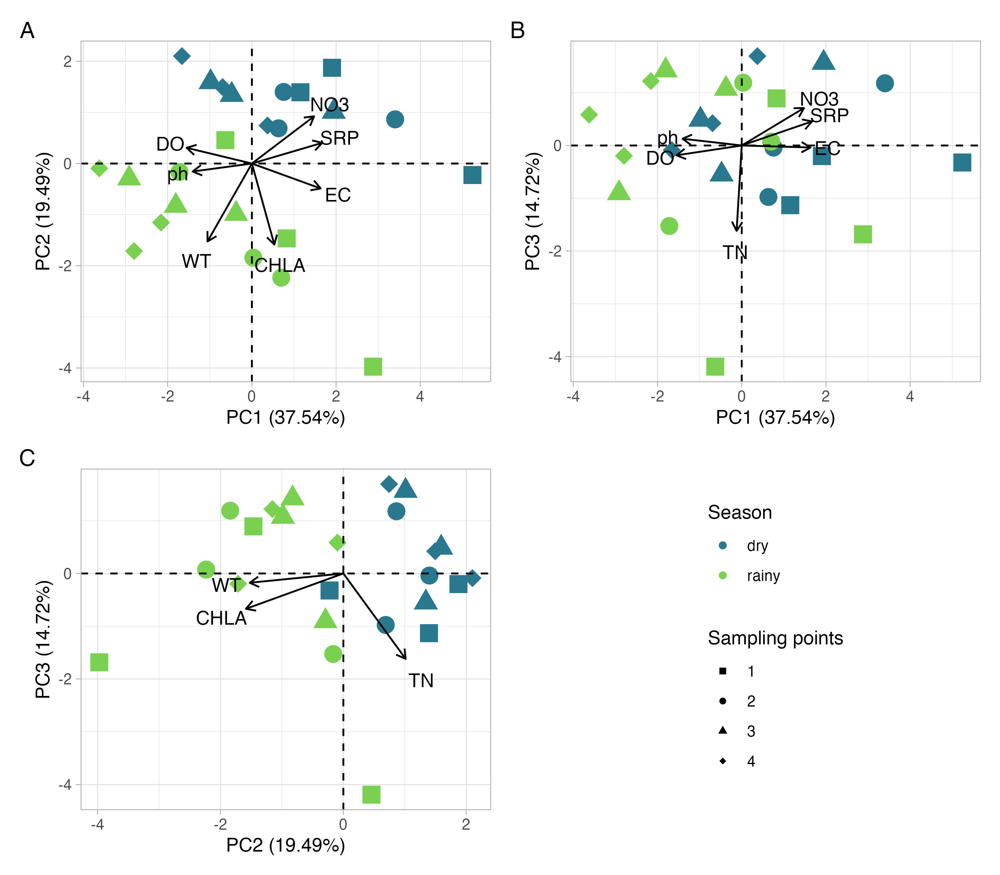
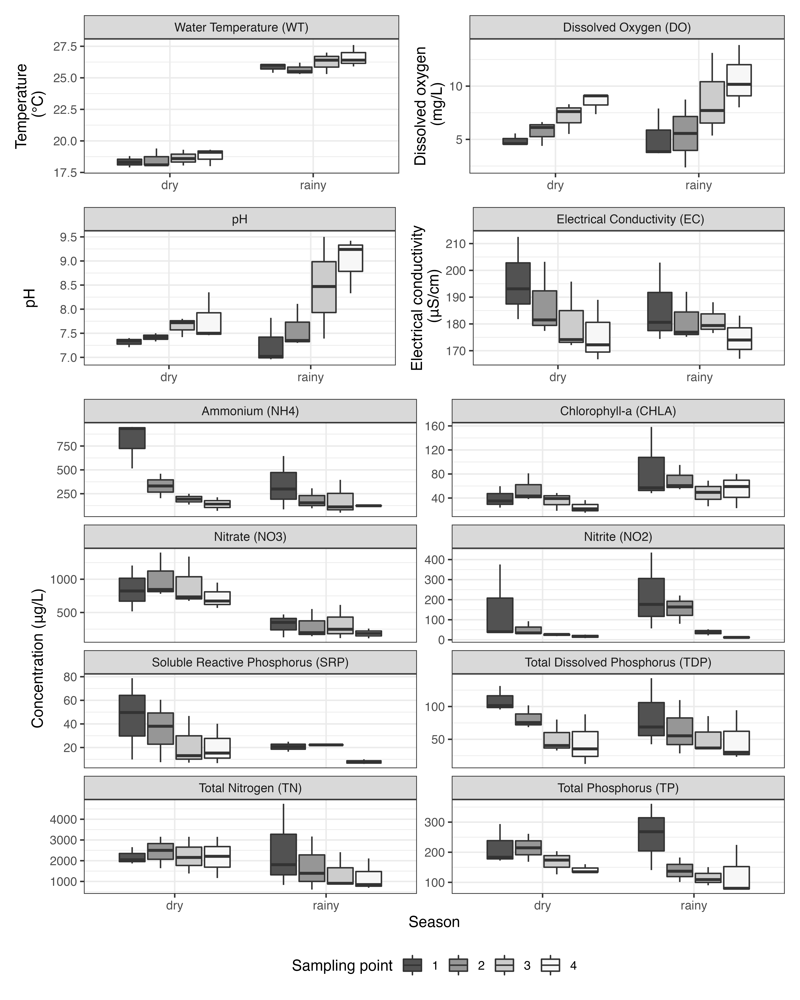

```{r setup, include=FALSE}
# knitr options
knitr::opts_chunk$set(
	echo = FALSE,
	message = FALSE,
	warning = FALSE
)
# Load the package
devtools::load_all()
```

# Spatio-temporal variability of water quality in Billings Reservoir Central Body - São Paulo, Brazil

**ABSTRACT**:

The Billings reservoir is an important water body for public supply of the Metropolitan Region of São Paulo, Brazil, and water captation for public supply is located in the Rio Grande environmental compartment. 
This article aims to evaluate water quality of the environmental compartment Central Body I of the Billings reservoir, which receives the reversed waters from the polluted Pinheiros river, at four sampling points with different contributions from the surroundings, seeking to verify the influence of seasonality on the results obtained and whether there was a difference in water quality between sampling points.
Water sampling was carried out on the surface at four points, in a longitudinal profile, covering two periods (dry and rainy) distributed in six samplings, between 2016 and 2019.
Analyzed variables included temperature, dissolved oxygen, pH, electrical conductivity, chlorophyll-a and nutrients (phosphorus and nitrogen). Space-Time Interaction tests revealed that physicochemical variables did not vary due to the interaction between sampling periods and points, but several variables varied significantly in function of the sampling period. Result of the Trophic State Index showed that waters of Central Body I were classified as Hypereutrophic, highlighting the degradation of water quality in this compartment. The results of this research can subsidize public managers in an attempt to minimize the effects of progressive degradation of water quality of this reservoir.

**KEYWORDS**: Eutrophication, Pinheiros river, Urban Reservoir.

**Variabilidade espaço-temporal da qualidade da água superficial do Corpo Central I da represa Billings - São Paulo, Brasil**

**RESUMO**:

A represa Billings é um reservatório importante para o abastecimento público da região metropolitana de São Paulo, no Brasil, e a captação de água para abastecimento público está localizada no compartimento ambiental Rio Grande.
Este artigo tem como objetivo avaliar a qualidade das águas do compartimento ambiental Corpo Central I da represa Billings, que recebe as águas revertidas do poluído rio Pinheiros, em quatro pontos de coleta com contribuição do entorno diferenciada, buscando verificar a influência da sazonalidade nos resultados obtidos e se houve diferença da qualidade da água entre os pontos de coleta.
As coletas de água foram realizadas na superfície em quatro pontos, em um perfil longitudinal, contemplando dois períodos (estiagem e chuvoso) distribuídos em seis coletas, entre os anos de 2016 e 2019.
As variáveis analisadas foram temperatura, oxigênio dissolvido, pH, condutividade elétrica, clorofila-a e nutrientes (fósforo e nitrogênio).
Os testes de Interação Espaço-Tempo revelaram que as variáveis físico-químicas não variaram devido à interação entre os pontos e períodos de amostragem, mas diversas variáveis variaram significativamente em função do período de amostragem. O resultado do Índice de Estado Trófico evidenciou que as águas do Corpo Central I foram classificadas como Hipereutróficas, destacando a degradação da qualidade das águas neste compartimento. Os resultados desta pesquisa podem subsidiar os gestores públicos na tentativa de minimizar os efeitos da degradação progressiva da qualidade da água deste reservatório.

**PALAVRAS-CHAVE**: Eutrofização, Rio Pinheiros, Reservatório Urbano.


## INTRODUCTION

Eutrophication is enrichment by nutrients (mainly nitrogen and phosphorus) in aquatic ecosystems and constitutes a growing global problem [@sinhaEutrophicationWillIncrease2017].  Eutrophication causes a decrease in water quality and prevent its use for human consumption in many cases [@nogueiraEutrofizacaoNoReservatorio2015; @andradeBalancoNitrogenioFosforo2020; @nobrePrecipitationLandscapeProperties2020]. For example, eutrophication increases turbidity and algae biomass, particularly toxin-producing groups (e.g., *Microcystis aeruginosa*).


The Metropolitan Region of São Paulo (MRSP) is located in the Southeast region of Brazil, with a population of more than 21.1 million inhabitants, which represents around 50% of the population of the State of São Paulo. The Billings reservoir is the largest reservoir of water in the Metropolitan Region of São Paulo, and has multiple uses, including public supply of water to the population [@rissoAnaliseDesempenhoReservatorio2018]; unfortunately, the low quality of its waters has been compromising its use for public supply.


The Billings reservoir was constructed in 1927 in order to supply water to the Henry Borden complex, a hydroelectric power plant. To supply the amount of water needed by the Henry Borden complex, the Billings reservoir received reversed waters from Tietê and Pinheiros rivers by the Pedreira Pumping Plant. 

The Billings reservoir has been impacted by eutrophication, which has been detected by several studies [@cardoso-silvaCompartimentalizacaoQualidadeAgua2014; @pompeoHeterogeneidadeEspacialHorizontal2015; @gargiuloBenthicMacroinvertebratesBioindicators2016; @alcantaraSatellitebasedInvestigationAlgae2021;  @cetesbQualidadeAguasInteriores2020]. Eutrophication in this reservoir results from two main sources: reversal of waters from the polluted Pinheiros and Tietê rivers, and occupation of its watershed [@wengratSpatialEvaluationWater2011; @cardoso-silvaCompartimentalizacaoQualidadeAgua2014; @cetesbQualidadeAguasInteriores2020]. 
The increasing pollution of waters from the Tietê and Pinheiros rivers, the consequent degradation of the Billings reservoir waters and the increasing need to use its waters as a source for public supply led to restrictions regarding the reversal of waters from the Tietê and Pinheiros rivers [@collacoUnderstandingEnergySystem2020].
Since 1992, pumping of waters from the Pinheiros river into the Billings reservoir has been allowed mainly for flood management purposes, which occurs most frequently in the rainy season. Nowadays, reversion of waters from Pinheiros and Tiete rivers is still allowed by legislation (Joint Resolution SMA/SSE-002/2010) in certain conditions, such as: flood control; formation of surfactant foams in the Tietê river that may overflow water surface; drop in water intake by the Henry Borden Plant to levels insufficient to ensure the supply of electricity in emergencies; and formation of algal blooms in water bodies of the Metropolitan Region of São Paulo and Médio Tietê, compromising their quality for purposes of public supply [@governodoestadodesaopauloRESOLUCAOCONJUNTASMA2010].


The aim of this study is the evaluation of spatial and temporal variability of water quality of the Billings reservoir in its Central Body. 'The following research questions drive this study: I) Is there a difference in water quality regarding sampling seasons? II) Does water quality vary spatially within the reservoir? III) Which variables have the largest influence on water quality at different sampling points and seasons?


## MATERIAL AND METHODS

### Characterization of study area

The Billings reservoir is located in the Metropolitan Region of São Paulo (State of São Paulo - Brazil) (Figure \@ref(fig:mapalocal)), and is part of six municipalities:  Santo André, São Bernardo do Campo, Diadema, Ribeirão Pires, Rio Grande da Serra and São Paulo.
This reservoir is part of the Upper Tietê Hydrographic Basin, a basin with low water availability per inhabitant.

The “Area of Protection and Recovery of Water Sources - Billings Reservoir” (APRWS - Billings) was created by the government of São Paulo (State law #13.579/2009), and separated the reservoir area into environmental compartments for land use and occupation planning purposes, namely as: Central Body I, Central Body II, Taquacetuba-Bororé, Rio Grande and Rio Pequeno, and Capivari-Pedra Branca. Water captation for public supply in the Billings reservoir is located in the Rio Grande environmental compartment, and in the 1980s a dam was constructed with the purpose of separating its waters from other environmental compartments, which were already impacted by water pollution.

```{r mapalocal, echo=FALSE, fig.cap="Map of the location of the Billings reservoir and sampling points. Source: Elaborated by the first author. Shapefiles from DataGEO (http://datageo.ambiente.sp.gov.br/). "}
knitr::include_graphics("maps/map.png")
```


### Analysis

The analysis and visualization of data and statistical analysis were performed using the R software (*https://www.r-project.org/*). R Packages used in this research are available on the Comprehensive R Archive Network (CRAN).

#### Quality evaluation of surface waters

Water was sampled on the surface covering four sampling points (P1 to P4) (Figure 1) and in two samplings periods: three in the dry season (August/2016, August/2017, August/2018) and three in the rainy season (January/2017, February/2018, February/2019), in order to analyze the influence of seasonality. The first sampling point (P1) is located close to the Pedreira Pumping Plant, and the fourth sampling point (P4) is located farthest from it.

Water temperature (WT), dissolved oxygen (DO), pH and electrical conductivity (EC) of water were measured *in situ* using a HACH sensor (model HQ40D).
Water samples were collected and analyzed for concentration of parameters: Total nitrogen (TN) [@valderramaSimultaneousAnalysisTotal1981], Nitrate (NO3) [@mackereth1978water], Nitrite (NO2) [@mackereth1978water], Ammonium (NH4) [@koroleffDeterminationNutrients1976], total phosphorus (TP) [@valderramaSimultaneousAnalysisTotal1981], total dissolved phosphorus (TDP) [@stricklandManualSeawaterAnalysis1960], Soluble reactive phosphorus (SRP) [@stricklandManualSeawaterAnalysis1960], and Chlorophyll-a (CHLA) [@cetesbNormaTecnicaL52014].
The Trophic State Index for tropical/subtropical reservoirs (TSI-tsr) was calculated according to @CUNHA2013126. The analysis and visualization of data was performed using the packages adespatial, SciViews, and tidyverse [@tidyverse2019].


#### Principal Component Analysis

A principal component analysis (PCA) was performed to summarize the variation of  nutrients (TN, NO2, NO3, NH4, TP, TDP, SRP), chlorophyll-a, and the following measures from water surface: water temperature, pH, dissolved oxygen and electrical conductivity. PCA was conducted with normalized variables and with a correlation matrix [@legendrelegendreNumericalEcology2012]. Axes were retained for interpretation following the Broken-Stick criterion [@jacksonStoppingRulesPrincipal1993]. Variables with loadings higher than |0.6| were considered as relevant for PCA axes ordination. PCA was performed using R software with stats and vegan packages, and visualization of PCA ordinations were made with ggplot2 [@tidyverse2019] and patchwork packages.


#### Space-time interaction analysis

Space-time interaction analysis (STI; Legendre et al., 2010) was used to assess whether there was an interaction between sampling points (space) and sampling periods (time) in the variation of physical, chemical, and biological parameters. This analysis is necessary because sampling in each period was carried out at four sampling points. In this case, testing the interaction between periods and sampling points by a traditional analysis of variance (ANOVA) is not possible due to the absence of replicates to estimate the sum of squares of residuals [@legendre2010]. In STI, a factorial ANOVA model was used with sub-adjusted interaction (model 5 in Legendre et al., 2010). This model allows testing the interaction in the absence of replication, has correct type I error rates and allows the use of univariate or multivariate response variables (Legendre et al., 2010). Therefore, as response matrix in STI, we used a matrix with all 15 physicochemical variables transformed by log10 (x + 1) (except pH) and standardized.

To explore which parameters varied according to sampling points and sampling periods, univariate STIs were performed with each physicochemical variable transformed by log10 (x + 1) (except pH) as response variable. Significance in STI was assessed using 999 permutations. A significance level of 5% was adopted and all analyses were performed in the R software with adespatial package.


#### Water quality standards in Brazil

The National Council for the Environment (CONAMA) created the Resolution No. 357 [@nationalenvironmentcouncilRESOLUCAOCONAMANo2005], which classifies water resources and regulates their predominant uses with water quality standards. The classification of water bodies proposed by this resolution presents classes as a set of conditions and standards of water quality necessary to meet the prevailing uses, current or future, and that must be considered as goals to be achieved by public managers.

The Billings reservoir was classified by the State Government of São Paulo as a Class II water body',  destaque_rev2)` [@saopaulostategovernmentDecretoNo101977]. According to the aforementioned resolution, Class II waters can be used for human consumption (after conventional treatment), for protection of aquatic communities, for primary contact recreation, for irrigation of vegetables, fruit plants and parks, gardens, sports fields and leisure, with which the public may have direct contact, aquaculture, and fishing activities',  destaque_rev2)` [@nationalenvironmentcouncilRESOLUCAOCONAMANo2005].

The results of this study will be compared with the standards established in the Conama Resolution No. 357 for Class II water bodies, in order to know if the quality standards of the water in the reservoir are in accordance with those established in the Brazilian legislation.

## RESULTS AND DISCUSSION

### Space-time interaction (STI)


```{r}
sti_multi <- readr::read_rds("analysis/results/sti_multi_tabela_final.Rds") %>% 
    dplyr::mutate(f = round(f, 2),
                p = round(p, 2),
                r2 = round(r2, 2),
                r2adj = round(r2adj, 2)
                )

sti_multi_st <- sti_multi %>% dplyr::filter(fator == "S*T")

sti_multi_s <- sti_multi %>% dplyr::filter(fator == "S")

sti_multi_t <- sti_multi %>% dplyr::filter(fator == "T")
```


Physicochemical variables did not vary due to the interaction between sampling periods and points (F~2,13~ = `r sti_multi_st$f`, p = `r sti_multi_st$p`0). Together, physicochemical variables varied between sampling periods (Sampling period: F~5,13~ = `r sti_multi_t$f`, p < 0.01, R²adj = `r sti_multi_t$r2adj`) and between sampling points (Sampling point: F~3,13~ = `r sti_multi_s$f`, p < 0.01, R²adj = `r sti_multi_s$r2adj`), and these factors explained about `r sti_multi_t$r2adj*100`%  and `r sti_multi_s$r2adj*100`%  of this physicochemical variability, respectively.


```{r include=FALSE}
sti_uni <- readr::read_rds("analysis/results/sti_uni_tabela_arrumada.Rds")

filtro_sti_signif_time_and_space <- sti_uni %>% dplyr::filter(
    significativo == TRUE, fator == "S*T") 

filtro_sti_signif_time <- sti_uni %>% 
  dplyr::filter(
 ! variavel %in% filtro_sti_signif_time_and_space$variavel, 
                significativo == TRUE, fator == "T") 

filtro_sti_signif_space <- sti_uni %>% 
  dplyr::filter(
 ! variavel %in% filtro_sti_signif_time_and_space$variavel, 
                significativo == TRUE, fator == "S") 
```


The interaction between sampling point and period was only significant when physicochemical variables were modeled separately for NO2 and WT, with low predictive power in these cases (Table \@ref(tab:table-sti)). 
TN, NO3, NH4, TDP, SRP, CHLA, DO, EC, and pH varied significantly in function of time (Table \@ref(tab:table-sti)).
For variation in time, explanatory power varied from a weak relationship (R²adj = `r min(filtro_sti_signif_time$r2adj)`) to a strong predictive power (R²adj = `r max(filtro_sti_signif_time$r2adj)`; Table \@ref(tab:table-sti)). 
NH4, TP, TDP, SRP, DO, EC, and pH varied significantly in function of space, among sampling points (Table \@ref(tab:table-sti)). For differences in space, explanatory power varied from a very weak relationship (R²adj ≈ 0.00) to a moderate predictive power (R²adj = `r max(filtro_sti_signif_space$r2adj)`; Table \@ref(tab:table-sti)).  


```{r table-sti}
sti_uni %>%
  dplyr::mutate(f = dplyr::case_when(
    significativo == TRUE ~ glue::glue("**{f}**"),
    TRUE ~ glue::glue("{f}")
  )) %>%
  dplyr::mutate(
    variavel = dplyr::case_when(
      variavel == "water_temperature" ~ "WT",
      variavel == "dissolved_oxygen" ~ "DO",
      variavel == "electrical_conductivity" ~ "EC",
      TRUE ~ variavel
    ),
    fator = dplyr::case_when(
      fator == "S*T" ~ "Space × Time",
      fator == "S" ~ "Space",
      fator == "T" ~ "Time",
      TRUE ~ fator
    ),
    
    p = dplyr::case_when(p == 0 ~ "< 0.01",
                         TRUE ~ as.character(p)),
    
    fator = forcats::fct_relevel(fator, c("Space × Time", "Space", "Time")),
    variavel = forcats::fct_relevel(
      variavel,
      c(
        "TN",
        "NO2",
        "NO3",
        "NH4",
        "TP",
        "TDP",
        "SRP",
        "CHLA",
        "WT",
        "DO",
        "EC",
        "pH"
      )
    ),
    
    
  ) %>%
    dplyr::arrange(variavel, fator) %>%
  dplyr::left_join(variable_names, by = c("variavel" = "variable")) %>%
  dplyr::mutate(variavel = glue::glue("{variable_name} ({variavel})")) %>%
  dplyr::select(-significativo, -r2,-variable_name) %>%

  
  
  
  dplyr::rename("Variable" = variavel,
                "F" = f,
                "Parameters" = fator) %>%
  
  flextable::flextable() %>%
  flextable::merge_v(j = c("Variable")) %>%
  flextable::autofit() %>%
  flextable::fontsize(size = 9) %>%
  ftExtra::colformat_md() %>%
  flextable::theme_zebra() %>% 
  ftExtra::span_header() %>%
  flextable::align(align = "center", part = "all") %>%
  flextable::set_caption(
    "Effect of space (sampling point) and time (sampling period) on the variation of physicochemical variables. S: space; T: time; S*T: interaction between space and time. F values in bold were significant."
  ) 
  
```

<br>

### Principal Component Analysis (PCA)

```{r}
resultados_pca <- readr::read_csv2(file = "analysis/results/pca_table.csv")

variance_explained_pca <- resultados_pca %>% 
  dplyr::filter(group == "Proportion of variance explained") %>% 
  dplyr::mutate(sum = PCA1 + PCA2 + PCA3) %>% 
  dplyr::pull(sum) %>% 
  round(2)


variance_explained_pc1 <- resultados_pca %>% 
  dplyr::filter(group == "Proportion of variance explained") %>% 
  dplyr::pull(PCA1) %>% 
  round(2)

variance_explained_pc2 <- resultados_pca %>% 
  dplyr::filter(group == "Proportion of variance explained") %>% 
  dplyr::pull(PCA2) %>% 
  round(2)

variance_explained_pc3 <- resultados_pca %>% 
  dplyr::filter(group == "Proportion of variance explained") %>% 
  dplyr::pull(PCA3) %>% 
  round(2)
```


The first three components from the Principal Component Analysis (PCA) were retained for interpretation following the Broken-Stick criterion. These three PCA axes explained `r variance_explained_pca`% of the total variance of limnological data (Table \@ref(tab:table-pca)). The PC1 explained `r variance_explained_pc1`% of the total variance of data, representing a gradient of individual contribution of nutrients (NO2, NO3, TDP and SRP) and electrical conductivity on the positive side, and dissolved oxygen and pH on the negative side (Table \@ref(tab:table-pca)). All these parameters are related to anthropogenic activities and high levels of eutrophication in the Billings Central Body I. PC2 explained `r variance_explained_pc2`% of the total variance, with NO2, WT and CHLA presenting the highest negative loadings. These results suggest the influence of higher temperature on phytoplankton growth indicated by high levels of CHLA that influence the change of pH due to the high consumption of CO2.  Finally, PC3 explained `r variance_explained_pc3`% of the total variance, represented by a gradient of total nutrients (TN and TP) with higher values on the negative side of this axis.

Samples are more clearly grouped by season than by spatial differences in limnological variables following a combination of PC1 and PC2 (Fig. \@ref(fig:pca)a), and PC2 and PC3 (Fig. \@ref(fig:pca)c). Samples from the dry period tended to present higher NO3, SRP, and lower WT (Fig. \@ref(fig:pca)a). This tendency can be related to lower phytoplankton biomass in this season. Within the rainy season, spatial differences were more evident mainly due to a tendency of increasing values of WT from site 1 to site 4. Furthermore, sampling point P1 also presented a higher variability in limnological variables considering both PC1 and PC2 scores, particularly in the rainy season (Fig. \@ref(fig:pca)a). Seasonal differences were less clear considering PC1 and PC3, but it is possible to infer that in the dry season, samples tended to present higher EC, lower DO and pH (Fig. \@ref(fig:pca)b). Finally, considering both PC2 and PC3, samples also tended to group by sampling season, with samples from the rainy season presenting higher WT and chlorophyll-a than those from the dry season (Fig. \@ref(fig:pca)c). These results probably indicate the influence of temperature and rainfall effects from reservoir adjacent areas favoring the growth of phytoplankton and elevating CHLA levels.

<!-- **Comentário Jean: Fiz uma interpretação da PCA no parágrafo acima segundo a fg. 4 parece que o que importa na separação em limnologia desses locais são mais diferenças sazonais. Acho que deve ir por aí na interpretação.** -->


```{r pca, echo=FALSE, fig.cap="Principal Component Analysis ordination summarizing limnological variables sampled in Billings reservoir from August, 2016 to February, 2019. Source: Elaborated by the authors."}

```
<br>
<!-- **Comentário Jean: Geralmente escolhemos um limiar para interpretar as cargas (loadings), p.ex., |0.6| ou |0.8|. Deixei destacado em negrito um limiar de |0.6| (e escrevi nos métodos) se acharem que está muito liberal (se aumentar o limiar, ficam menos variáveis para interpretarmos) alterem aqui.** -->

```{r table-pca, tab.id = "table-pca"}
resultados_pca %>%
  dplyr::mutate(
    Variables = dplyr::case_when(
      Variables == "water_temperature" ~ "WT",
      Variables == "dissolved_oxygen" ~ "DO",
      Variables == "electrical_conductivity" ~ "EC",
      Variables == "ph" ~ "pH",
      is.na(Variables) ~ " ",
      TRUE ~ Variables
    )
  ) %>%
  dplyr::left_join(variable_names, by = c("Variables" = "variable")) %>%
  dplyr::mutate(Variables = dplyr::if_else(
    !is.na(variable_name),
    glue::glue("{variable_name} ({Variables})"),
    ""
  )) %>% 
  dplyr::rename("Group" = "group") %>% 
  dplyr::select(-variable_name) %>% 
  flextable::flextable() %>%
  flextable::merge_v(j = c("Group")) %>%
  flextable::autofit() %>% 
  flextable::fontsize(size = 9) %>%
  ftExtra::colformat_md() %>% 
  flextable::theme_zebra() %>% 
   ftExtra::span_header() %>% 
  flextable:: align(align = "center", part = "all") %>% 
  flextable::width(j = "Group", width = 1) %>% 
  flextable::merge_at(i = 1:1, j = 1:2 ) %>% 
  flextable::merge_at(i = 2:2, j = 1:2 ) %>% 
  flextable::set_caption(
    "Loadings, Eigenvalues and Proportion of explained variance of a Principal Component Analysis (PCA) ordination summarizing limnological variables sampled in Billings reservoir from August, 2016 to February, 2019. Only the axes with eigenvalues higher than those expected by a Broken-Stick distribution are presented. Variables with loadings higher than |0.6| are highlighted in bold."
  )
  
```

<br>

### Physicochemical parameters

```{r}
stats_season <- sampling_data_long %>%
  dplyr::group_by(season, variable) %>%
  dplyr::summarise(
    min = round(min(result_variable, na.rm = TRUE), 2),
    max = round(max(result_variable, na.rm = TRUE), 2),
    mean = round(mean(result_variable, na.rm = TRUE), 2),
  )

stats_unique <- sampling_data_long %>%
  dplyr::group_by(variable) %>%
  dplyr::summarise(
    min = round(min(result_variable, na.rm = TRUE), 2),
    max = round(max(result_variable, na.rm = TRUE), 2),
    mean = round(mean(result_variable, na.rm = TRUE), 2),
  )
```

```{r}
stats_wt <- stats_season %>%
  dplyr::filter(variable == "water_temperature") 

media_wt_dry <-
 stats_wt %>% 
  dplyr::filter(season == "dry") %>%
  dplyr::pull(mean)

media_wt_rainy <-
  stats_wt %>% 
  dplyr::filter(season == "rainy") %>%
  dplyr::pull(mean)
```

Water temperature (WT) tended to be higher in the rainy season than in the dry one for all sampling points (Figure \@ref(fig:boxplot-geral)). WT is an important parameter that influences the DO and also affects aquatic communities [@sahaEvaluationSpatiotemporalChanges2021]. That happens because  with increasing temperature, oxygen solubility decreases [@matearLongtermChangesDissolved2003], which further hampers its consumption by organisms and may cause physiological stress when oxygen consumed does not supply metabolic demands [@nebekerEffectLowDissolved1996; @romanInteractiveEffectsHypoxia2019]. Mean values for the dry and rainy seasons were `r media_wt_dry`°C and `r media_wt_rainy`°C respectively. Results for water temperature were similar to other tropical reservoirs and this difference is related to air temperature. Similar results about seasonality influence on WT were obtained by @sahaEvaluationSpatiotemporalChanges2021 in tropical Metther reservoir, in India.


```{r boxplot-geral, echo=FALSE, fig.cap= "Variation of Water temperature, Dissolved oxygen, pH, Electrical conductivity, nutrients, and Chlorophyll-a according to season and sampling point. Each box represents interquartile range, horizontal thick line represents median and whiskers represent minimum and maximum values. Source: Elaborated by the authors.", fig.height=8}
  
```


```{r}
stats_od <- stats_season %>% 
  dplyr::filter(variable == "dissolved_oxygen")

stats_od_rainy <- stats_od %>% 
  dplyr::filter(season == "rainy") 

stats_od_dry <- stats_od %>% 
  dplyr::filter(season == "dry") 

```

Dissolved oxygen (DO) ranged from `r dplyr::pull(stats_od_dry, min)` to `r dplyr::pull(stats_od_dry, max)` mg/L during the dry season. Variation  on  rainy  season was from `r dplyr::pull(stats_od_rainy, min)` to `r dplyr::pull(stats_od_rainy, max)` mg/L. 
DO tended to be more variable in each sample site in the rainy season. For site four, DO tended to be higher in the rainy than in the dry season. All sampling points showed the highest values during the rainy season. The standard for DO for Class II water bodies is > 5.0 mg/L [@nationalenvironmentcouncilRESOLUCAOCONAMANo2005], and 25% of water samples in both seasons were not in accordance with this standard. The high concentration of CHLA in the same period (Figure \@ref(fig:boxplot-geral)) indicates the possible contribution produced by phytoplankton photosynthesis. Furthermore, the diffusion by turbulent mixing by rain and/or water reversal from the Pinheiros and Tietê rivers to the Billings reservoir may also contribute to higher O2 in the rainy period. 


```{r}
stats_ph <- stats_season %>% 
  dplyr::filter(variable == "ph")

stats_ph_rainy <- stats_ph %>% 
  dplyr::filter(season == "rainy") 

stats_ph_dry <- stats_ph %>% 
  dplyr::filter(season == "dry") 

```


The variation of pH values was from `r dplyr::pull(stats_ph_dry, min)` to `r dplyr::pull(stats_ph_dry, max)` in the dry season and from `r dplyr::pull(stats_ph_rainy, min)` to `r dplyr::pull(stats_ph_rainy, max)` in the rainy season. pH tended to be more variable in each sample site in the rainy season. For sites three and four, pH tended to be higher in the rainy season than in the dry one (Figure \@ref(fig:boxplot-geral)). The standard for pH for Class II water bodies is between 6.0 and 9.0 [@nationalenvironmentcouncilRESOLUCAOCONAMANo2005], and 25% of water samples in the rainy season were not in accordance with this standard. pH results indicated the tendency from neutral (P1) to alkalinity (P4) conditions in both seasons along the sampling points. 

The activities of aquatic microorganisms are influenced by pH and drive pH variation. Higher values of CHLA verified during the rainy season can indicate phytoplankton growth. With a higher phytoplankton growth, a higher photosynthesis would be fixing more C and releasing H (both often available as HCO3- in the observed pH range) to the water column, collaborating to the change toward alkaline conditions [@horneLimnology1994; @maberlyDielEpisodicSeasonal1996; @nazneenSpatialTemporalDynamics2019]. The highest values for pH were observed in the rainy season; the same tendency was observed for DO. In the report from @cetesbQualidadeAguasInteriores2020, pH followed the behavior observed for DO, with values that exceed those considered a quality standard in 44% of the samples during 2019, and high oxygen concentrations are due to algal bloom events, confirming the state of eutrophication of the reservoir [@cetesbQualidadeAguasInteriores2020].


```{r}
stats_ec <- stats_season %>% 
  dplyr::filter(variable == "electrical_conductivity")

stats_ec_rainy <- stats_ec %>% 
  dplyr::filter(season == "rainy") 

stats_ec_dry <- stats_ec %>% 
  dplyr::filter(season == "dry") 

mean_ec <- stats_unique %>% 
  dplyr::filter(variable == "electrical_conductivity") %>% 
  dplyr::pull(mean)

```


Electrical conductivity (EC) is the ability of a solution to conduct a given electrical current; it means that the higher ion concentration in the water, the greater its electrical conductivity. EC ranged from `r dplyr::pull(stats_ec_dry, min)` to `r dplyr::pull(stats_ec_dry, max)` µS/cm in the dry season and from `r dplyr::pull(stats_ec_rainy, min)` to `r dplyr::pull(stats_ec_rainy, max)` µS/cm in the rainy season. EC tended to be lower in the rainy season than in the dry one, especially in sampling sites one and two (Figure \@ref(fig:boxplot-geral)). Comparing EC between sampling points, the highest value was obtained for P1 for both seasons. EC results showed higher values during the dry season, and it showed the opposite tendency compared to DO and pH tendencies. 
<!-- **COMENTÁRIO JEAN: É interessante especular sobre o(s) mecanismo(s) dessa maior condutividade na seca. Isso poderia ser um efeito da menor quantidade de água nesse período ter um menor potencial de diluir as águas com poluentes (águas com maior quantidade de macronutrientes que afetam a condutividade, p.e., Mg, Na, Ca)?** -->
 @wengratSpatialEvaluationWater2011 also obtained higher values in the dry season. @sahaEvaluationSpatiotemporalChanges2021 also observed higher values of EC (183.6 - 428.8 µS/cm) in an Indian tropical reservoir and attributed it to pollution accumulation. In this work we also attribute this highest concentration to pollution accumulation, because in the dry season there is less inlet of rainwater to dilute pollutants. Also, mean values in this study were around `r mean_ec` µS/cm and similar in both seasons.


```{r}

mean_tn <- stats_unique %>% 
  dplyr::filter(variable == "TN") %>% 
  dplyr::mutate(mean = round(mean, 2)) %>% 
  dplyr::pull(mean)

stats_no3 <- stats_season %>% 
  dplyr::filter(variable == "NO3")

stats_no3_rainy <- stats_no3 %>% 
  dplyr::filter(season == "rainy") 

stats_no3_dry <- stats_no3 %>% 
  dplyr::filter(season == "dry") 

```

```{r}
p1_nh4 <- sampling_data_long %>% dplyr::filter(variable == "NH4",
                                     sampling_sites == 1) %>% 
  dplyr::group_by(season, variable, sampling_sites) %>% 
  dplyr::summarise(mean = round(mean(result_variable), 2))


```


Total nitrogen (TN; Figure \@ref(fig:boxplot-geral)) presented higher values during the dry season  compared to the rainy season, except for P1. TN mean value was `r mean_tn` µg/L, which shows an increase in TN compared to values obtained by @cardoso-silvaCompartimentalizacaoQualidadeAgua2014, who carried out sampling at some points in the Billings reservoir in 2014, obtaining a mean of 1230 µg/L for TN. Values obtained for Nitrite-N (NO2) were lower when compared to NO3 and NH4. This result is explained because among nitrogenous forms, nitrite is considered the most unstable one in aquatic ecosystems, as it is quickly converted to nitrate [@sahaEvaluationSpatiotemporalChanges2021].   The standard for NO2 and NO3 for Class II water were met in all water samples, in the dry and rainy seasons.


Nitrate (NO3) and NH4 have an important role in water quality, being the main sources of nitrogen for aquatic primary producers. Nitrate (Figure \@ref(fig:boxplot-geral)) showed higher values during the dry season (`r dplyr::pull(stats_no3_dry, min)` - `r dplyr::pull(stats_no3_dry, max)` µg/L) compared to the rainy season (`r dplyr::pull(stats_no3_rainy, min)` - `r dplyr::pull(stats_no3_rainy, max)` µg/L). The highest value of NO3 and TN during dry season may be due to the entry of more concentrated sewage because there is little rain contribution, and it may also be related to lower phytoplankton biomass. 
@cardoso-silvaCompartimentalizacaoQualidadeAgua2014 obtained results in the Billings reservoir for NO3 that ranged from 290.52 µg/L to 464.1 µg/L. The highest value of `r dplyr::pull(stats_no3_dry, max)` obtained in this study was much higher than the one found in 2014 by @cardoso-silvaCompartimentalizacaoQualidadeAgua2014, revealing an increasing of nitrate levels in the Central Body I. Higher NH4 values were obtained in P1 for both seasons, with mean values of `r dplyr::filter(p1_nh4 , season == "dry") %>% dplyr::pull(mean)` µg/L (dry season) and `r dplyr::filter(p1_nh4 , season == "rainy") %>% dplyr::pull(mean)` µg/L (rainy season) in P1. The highest value obtained for NH4 concentration by @cardoso-silvaCompartimentalizacaoQualidadeAgua2014 was 233.00 µg/L. The highest values for NH4 at P1 in this study can be a consequence of reversal waters from the Pinheiros river, since this sampling point is located close to the Pedreira Pumping Plant. Around 42% of water samples in the rainy season were not in accordance with the standard for Class II water bodies [@nationalenvironmentcouncilRESOLUCAOCONAMANo2005], while around 50% of water samples were not in accordance with this standard in the dry one. 

```{r}
stats_tp <- stats_season %>% 
  dplyr::filter(variable == "TP")

stats_tp_rainy <- stats_tp %>% 
  dplyr::filter(season == "rainy") 

stats_tp_dry <- stats_tp %>% 
  dplyr::filter(season == "dry") 


mean_tp <-  stats_unique %>% dplyr::filter(variable == "TP") %>% dplyr::pull(mean)
```


Phosphorus is an important nutrient to primary producers and it is also used to indicate trophy of aquatic ecosystems. 
Total Phosphorus (TP) varied from `r dplyr::pull(stats_tp_dry, min)` to `r dplyr::pull(stats_tp_dry, max)` µg/L in the dry season and from `r dplyr::pull(stats_tp_rainy, min)` to `r dplyr::pull(stats_tp_rainy, max)` µg/L in the rainy season. 
The mean value for TP in both seasons was `r mean_tp ` µg/L, and it was higher in the rainy season than in the dry season only for sampling site one, while the remaining sites tended to show lower values in the rainy season than in the dry season (Figure \@ref(fig:boxplot-geral)). 
The same tendency was observed by @wengratSpatialEvaluationWater2011, who also determined higher results for TP during the rainy season. The trend of increasing TP concentrations in rainy months, in the Central Body of the Billings reservoir, may be associated with the increase in surface runoff due to the rainy season carrying nutrients to waters; and to the Pinheiros river reverse pumping to the Billings reservoir, which increases the affluent polluting loads into the water @cetesbQualidadeAguasInteriores2020. 
According to @cetesbQualidadeAguasInteriores2020, in 2019, a greater volume of waters from the Pinheiros river was pumped into the Billings reservoir in the rainy season, especially in February and March, resulting in a greater input of Phosphorus and other pollutants into the Central Body I of the reservoir [@cetesbQualidadeAguasInteriores2020].  The standard for TP for Class II water bodies is < 100 µg/L [@nationalenvironmentcouncilRESOLUCAOCONAMANo2005], and all water samples in the rainy season were not in accordance with this standard, while 75% of water samples were not in accordance with this standard in dry one. 


```{r}
stats_tdp <- stats_season %>% 
  dplyr::filter(variable == "TDP")

stats_tdp_rainy <- stats_tdp %>% 
  dplyr::filter(season == "rainy") 

stats_tdp_dry <- stats_tdp %>% 
  dplyr::filter(season == "dry") 

stats_srp <- stats_season %>% 
  dplyr::filter(variable == "SRP")

stats_srp_rainy <- stats_srp %>% 
  dplyr::filter(season == "rainy") 

stats_srp_dry <- stats_srp %>% 
  dplyr::filter(season == "dry") 

```

Results for Total dissolved phosphorus (TDP) ranged from `r dplyr::pull(stats_tdp_dry, min)` to `r dplyr::pull(stats_tdp_dry, max)` µg/L during the dry season and from  `r dplyr::pull(stats_tdp_rainy, min)` to `r dplyr::pull(stats_tdp_rainy, max)` µg/L during the rainy season. The soluble reactive phosphorus (SRP) fractionor Orthophosphate comprises all types of inorganic phosphorus in solution [@markadTrophicStateModeling2019]. SRP varied seasonally, being higher and more variable in the dry season than the rainy season for all sampling points. SRP results in the dry season ranged from `r dplyr::pull(stats_srp_dry, min)` to `r dplyr::pull(stats_srp_dry, max)` µg/L, and from `r dplyr::pull(stats_srp_rainy, min)` to `r dplyr::pull(stats_srp_rainy, max)` µg/L during the rainy season. As SRP is the main form of phosphorus assimilated by phytoplankton, the lower values obtained in the rainy season can be associated with greater phytoplankton biomass (Chlorophyll-a) obtained in that season.


```{r}
stats_chla <- stats_season %>% 
  dplyr::filter(variable == "CHLA")

stats_chla_rainy <- stats_chla %>% 
  dplyr::filter(season == "rainy") 

stats_chla_dry <- stats_chla %>% 
  dplyr::filter(season == "dry") 

```


Chlorophyll-a (CHLA) is a parameter used as an indicator of algal biomass and also considered the main indicator of the trophic state of aquatic environments [@cetesbQualidadeAguasInteriores2020]. CHLA concentration in dry season ranged from `r dplyr::pull(stats_chla_dry, min)` to `r dplyr::pull(stats_chla_dry, max)` µg/L and from `r dplyr::pull(stats_chla_rainy, min)` to `r dplyr::pull(stats_chla_rainy, max)` µg/L in the rainy season. Higher values of CHLA were observed during the rainy season. The highest CHLA value was verified in P1 during the rainy season and may be associated with the reversing of waters from Pinheiros river waters into the Billings reservoir, to prevent flooding in the floodplain of the Pinheiros river during the rain period in the city of São Paulo [@cardoso-silvaCompartimentalizacaoQualidadeAgua2014]. The standard for CHLA for Class II water bodies is < 30 µg/L [@nationalenvironmentcouncilRESOLUCAOCONAMANo2005], and around 85% of water samples in the rainy season were not in accordance with this standard, while around 67% of water samples were not in accordance with this standard in the dry one. 


Nitrogen and phosphorus forms had the highest values in the dry season. Comparison with CHLA variation indicated an inverse trend, presenting higher values in the rainy season. These results indicate that the highest phytoplankton density contributed with the decay of nitrogen and phosphorus since they are essential to phytoplankton development and reproduction [@jeppesenLakeResponsesReduced2005; @marcarelliEffectsUpstreamLakes2007; @filstrupRelationshipChlorophyllPhosphorus2017]. Nutrient availability and increased concentrations of CHLA in water surface from the water ascending operational phase appear to be linked to the rainy season, bringing organic matter and dissolved nutrients from surrounding areas to the reservoir.


Results indicate P1 in the rainy season as a nutrient-rich environment, and may indicate the presence of cyanobacteria [@rochaWaterQualityIndex2014] (Figure \@ref(fig:boxplot-geral)).  @ribeiroDetectionCyanotoxinProducingGenes2020 observed highest cyanobacteria concentration in the same period confirming the tendency of eutrophic environment favoring the presence of these groups of microorganisms. Furthermore, lower CHLA concentrations in the falling water compared with the low water operational phase also seem to be explained by water residence time. 

```{r}
tsi_tsr_df <-
  sampling_data_wide %>%
  dplyr::count(tsi_tsr_class) %>%
  dplyr::mutate(porcentagem = round(n /
                                      sum(n) * 100, 1))


tsi_hyper <- tsi_tsr_df %>%
  dplyr::filter(tsi_tsr_class == "Hypereutrophic") %>%
  dplyr::pull(porcentagem)

tsi_super <-
  tsi_tsr_df %>% 
  dplyr::filter(tsi_tsr_class == "Supereutrophic") %>% 
  dplyr::pull(porcentagem)

```

The application of Trophic State Index for tropical/subtropical reservoirs [@CUNHA2013126] resulted in around `r tsi_hyper`% of the samples being classified as Hypereutrophic, and `r tsi_super`% as Supereutrophic. These results show that, in all four sampling points, and in the rainy and dry seasons, waters of the Billings reservoir are impacted by eutrophication.  In a study by @alcantaraSatellitebasedInvestigationAlgae2021 in the Billings reservoir, waters of the Central Body I were classified as Hypereutrophic both in 2019 and 2020.

Other examples of tropical reservoir that are impacted by eutrophication are: Guarapiranga reservoir, in the State of São Paulo - Brazil [@alcantaraSatellitebasedInvestigationAlgae2021] and Barra Bonita reservoir, also in the State of São Paulo - Brazil [@watanabeEstimationChlorophyllaConcentration2015]. Also, @boechatDissolvedOrganicShallow2019a studied six shallow lakes and two reservoirs at the Atlantic forest in Southeastern Brazil and determined hypereutrophic state to lake Rasa and Pampulha reservoir.


## CONCLUSIONS

```{r}
variables_most_sig_sti <- dplyr::bind_rows(filtro_sti_signif_space, filtro_sti_signif_time) %>% 
  dplyr::arrange(desc(r2adj)) %>% 
  dplyr::filter(r2adj >= 0.50) %>% 
  dplyr::pull(variavel) %>%
  stringr::str_replace_all(pattern = "_", replacement = " ") %>% 
  stringr::str_replace_all(pattern = "electrical conductivity", replacement = "EC") %>% 
  knitr::combine_words()
```


The results of this study show that waters of the Central Body I in Billings reservoir are impacted by eutrophication in both seasons (dry and rainy) and all sampling points. It is important to monitor the water quality of this reservoir, especially for TP, CHLA and NH4, in which showed that several samples that the results were not in accordance with the standards of the Brazilian Legislation, set by National Environment Council [-@nationalenvironmentcouncilRESOLUCAOCONAMANo2005].

Statistical analysis showed that seasonality presents a greater influence on water quality in the reservoir, compared to the difference between sampling points. 
Response variables that have the largest influence on the analysis of water quality, at the different sampling points and seasons, were `r variables_most_sig_sti`, since they varied significantly and presented the highest predictive power in the STI tests. WT is a variable closely related to sampling season, and other variables are more related to the input of pollution on the reservoir.  

P1 is the sampling point that is closer to the Pedreira Pumping Plant, and results indicate that waters in this sampling point are the most polluted. These results showed the influence of dumping reversed waters from the polluted Pinheiros and Tiete rivers on the Billings reservoir. It is important that the quality of waters of the Pinheiros and Tiete rivers are improved, in order to minimize the degradation of the Central Body I of the Billings reservoir. Another important effort that is needed is to improve the collection and treatment of wastewater on the households that are on the Billings watershed. One important step towards these  goals is the “New Pinheiros river Program” (https://novoriopinheiros.sp.gov.br/), which is a program led by the State Government. This program aims the depollution of the Pinheiros river, based on basic sanitation, cleaning, dredging and environmental education. The effects of this program will be seen in future research, and the results obtained in this research will serve as comparative parameters, in order to evaluate the effects of the future Pinheiros river depollution on the water quality of the Central Body I of the Billings reservoir.

This study presents recent data about a water body that is important to the public water supply in the Metropolitan Region of São Paulo, a region with more than 21 million inhabitants. Therefore, these results can subsidize public managers in an attempt to minimize the effects of progressive degradation of water quality of this reservoir.


## ACKNOWLEDGMENTS

The first author thanks the São Paulo Research Foundation (FAPESP) - Grant number XXXX/XXXXX-X. The third author thanks the Coordination for the Improvement of Higher Level Personnel (CAPES) for a postdoctoral scholarship. The last author thanks the  São Paulo Research Foundation (FAPESP) and Basic Sanitation Utility Company of the State of São Paulo (SABESP) - Grant number XXXX/XXXXX-X.

## REFERENCES

```{r echo=FALSE}
# knitr::write_bib(c('knitr', 'rmarkdown',  'pagedown', "tidyverse", "factoextra", "flextable", "SciViews", "vegan", "STI", "ggplot2", "adespatial", "patchwork", "dplyr", "stats"), 'referencias/packages.bib')

# knitr::write_bib(c("dplyr"), 'referencias/packages2.bib')
```

```{=html}
<!-- This '<div id="refs"></div>' needs to 
be here if you have appendix pages 
otherwise you can remove it.-->
```
::: {#refs}
:::

<!-- ## AUTHORS CONTRIBUTION -->

<!-- Beatriz Milz - This article is based on research carried out as part of her Msc dissertation. -->
<!-- Participated in sample collection and water samples analysis, participated in the data and statistical analysis, wrote the text. -->

<!-- Cristina Souza Freire Nordi - First author supervisor of the dissertation, participated in the collection of the water samples, wrote and reviewed the text. -->

<!-- Jean Ortega - participated in the data and statistical analysis, wrote and reviewd the text. -->

<!-- Patricia Oliveira de Aquino - Participated in sample collection and in the analysis of the water samples. -->

<!-- Ana Luiza Vietti Bitencourt - First author co-supervisor of the dissertation. -->

